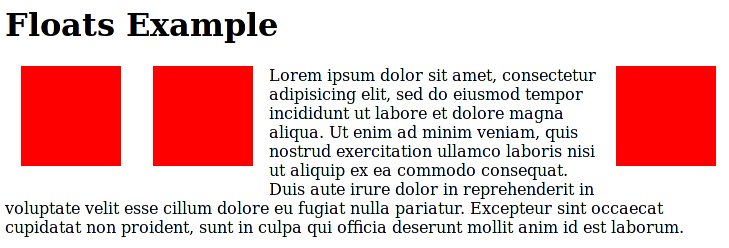

###
CSS
###

:author: Ryan E. Freckleton
:date: 2016-06-14
:organization: PySprings

Front Matter
============
Outline
-------
.. contents::

Meeting Introduction
--------------------

feedback (anonymous)
    http://sayat.me/pysprings

- Professional, safe environment
- Be kind to others. Do not insult or put down other attendees. Behave
  professionally
- If you don't feel safe, let me know!

Greetings
---------

0. What's your name?
1. How did you get here?
2. What would you like to happen tonight?
3. What expertise, experience or talents do you have that others might find
   useful?

Getting Started
===============
Serving HTML
------------
To start with, we will serve Serve HTML and a style sheet::

    $ python -mSimpleHTTPServer
    Serving HTTP on 0.0.0.0 port 8000 ...

Then visit http://localhost:8000 in your favorite browser.

.. note:: Remember to refresh as you work!

HTML
----

`hello.html`

.. see:: hello.html

CSS
---

`hello.css`

.. see:: hello.css

Semantic HTML
=============
Semantic HTML
-------------
- HTML is a tree
- "Semantic HTML" means naming things what they are

  - Use HTML5 tags if possible
  - If not, use a CSS class to name them properly

- Don't use IDs for CSS
- Organize CSS into "modules" and "components"

  - Modules are coherent semantic entitites that are independent
  - Components are individual pieces of modules, which may not necessarily be
    independent
  - Name them using "someModule-someComponent"

Layout
======
Box Model
---------
Everything rendered in HTML follows the "box model"

- An item has content, padding, border and margin.
- Each box is laid out with other boxes, and may contain other boxes inside it

Example
-------
e.g. from hello2.css

.. see:: hello2.css body

Float Model
-----------
By default, items "float", flowing around other content on the page. Items can
also be fixed relative to the viewport or "absolutely" compared to the corner
of its containing element.

- These are controlled with the `float` and `position` CSS attributes.
- `float` determines whether it floats `left`, `right` or doesn't.  `position`
  can be `static`, `relative`, `absolute`, or `fixed`.

Example
-------

   CC-BY-SA MDN Wiki

Blocks vs Flow
--------------
- Some elements, like tables, images, buttons, etc. are by default "blocks",
  they are one size and are aligned against other elements.
- Other items, such as paragraphs and divs, are "flow" elements, which change
  in size based on their content.
- You can also set an item to be an `inline-block` with their `display`
  element, which means a collection of blocks are flowed, for example, a set of
  buttons that are automatically flowed into multiple rows if the viewport is
  too small.

Responsive Design
-----------------
Media Queries
    You can setup your CSS using `media-queries` that activate different parts
    of style for different platforms

Relative Measures
    Use `em`, `ex`, `rem` and percentages. These will modify based on zoom and
    display.

.. note:: You'll also have to create a "viewport" metatag for it to display
          properly on iPhone and other mobile devices.

Styling
=======
Fonts
-----
- Google and others provide high quality web fonts you can use on your website.
- Fonts are controlled with the `font-family` and `font-weight` properties.

Colors
------
- There are several builtin colors in CSS that vary somewhat across browsers
- Colors can also be defined using the `rgb` function or hexcodes
- the `color` property determines the color of content in an element,
  `background-color` determines the color of the box that makes the element
- With CSS 3, we can also have gradients with the `linear-gradient`,
  `radial-gradient` and related functions.

Rendering
---------
- Various parts of how items are rendered/displayed can be changed.
- `display` controls block vs inline (flow) vs inline-block
- `border-radius` can make things curved
- `drop-shadow`, `box-shadow`, etc. can add shadows and shading
- `::before` and `::after` pseudo-selectors allow for creating content.

Images
------
- Images can be set as the `content`, `background-image` or `list-style-image`
  of objects. They can also be set to the `border-image` in CSS 3

Basics of Design
================

Contrast
--------
- Make different things different. For example, have small, whispy fonts and
  big bold block letters.
- Have big things be purple and small things be gold
- Don't let things "almost be the same", small differences look like accidents.
  Big differences look purposeful
- Don't be a wimp!

Repetition
----------
- Repeat the same types of elements for the same types of things
- Every page should have a consistent look and feel
- Make all buttons black (for example)
- Make all links have underlines or brighten on mouse-over
- Use the same fonts

Alignment
---------
- Have strong lines of alignment in your design
- Avoid center alignment, if you do have it, make it really obvious
- Have a few lines of alignment that everything uses

Proximity
---------
- Put semantically related elements together
- Move semantically unrelated elements away from each other
- Semantic HTML helps with this

Jinja2
======
Examples
--------
- http://cerris.com
- Now, Let's look at its templates
